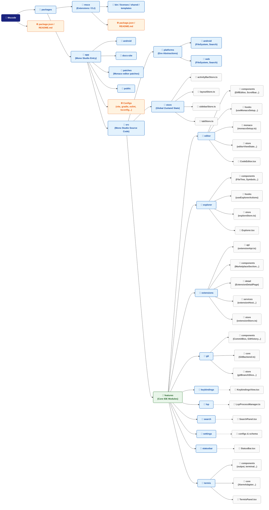

```mermaid
flowchart LR
    %% Style Definitions
    classDef root fill:#1A237E,stroke:#fff,stroke-width:2px,color:#fff,rx:8px,ry:8px,font-weight:bold;
    classDef folder fill:#E3F2FD,stroke:#1565C0,stroke-width:1.5px,color:#0D47A1,rx:5px,ry:5px;
    classDef file fill:#FAFAFA,stroke:#9E9E9E,stroke-width:1px,color:#424242,rx:4px,ry:4px;
    classDef config fill:#FFF3E0,stroke:#E65100,stroke-width:1px,color:#E65100,rx:4px,ry:4px;
    classDef feature fill:#E8F5E9,stroke:#2E7D32,stroke-width:1.5px,color:#1B5E20,rx:5px,ry:5px;

    %% Root
    Mscode["📁 Mscode"]:::root
    
    Mscode --> pkgs["📁 packages"]:::folder
    Mscode --> root_files["⚙️ package.json / README.md"]:::config

    %% Packages
    pkgs --> app["📁 app<br/>(Mono Studio Entry)"]:::folder
    pkgs --> msce["📁 msce<br/>(Extensions / CLI)"]:::folder

    %% MSCE Structure
    msce --> msce_dirs["📁 bin / licenses / shared / templates"]:::folder
    msce --> msce_files["⚙️ package.json / README.md"]:::config

    %% App Structure
    app --> app_android["📁 android"]:::folder
    app --> app_docs["📁 docs-site"]:::folder
    app --> app_patches["📁 patches<br/>(Monaco editor patches)"]:::folder
    app --> app_public["📁 public"]:::folder
    app --> app_configs["⚙️ Configs<br/>(vite, gradle, eslint, tsconfig...)"]:::config
    app --> app_src["📁 src<br/>(Mono Studio Source Code)"]:::folder

    %% SRC Structure
    app_src --> plat["📁 platforms<br/>(Env Abstractions)"]:::folder
    app_src --> store["📁 store<br/>(Global Zustand State)"]:::folder
    app_src --> feat["📁 features<br/>(Core IDE Modules)"]:::feature

    %% Platforms
    plat --> p_and["📁 android<br/>(FileSystem, Search)"]:::folder
    plat --> p_web["📁 web<br/>(FileSystem, Search)"]:::folder

    %% Store
    store --> s_act["📄 activityBarStore.ts"]:::file
    store --> s_lay["📄 layoutStore.ts"]:::file
    store --> s_side["📄 sidebarStore.ts"]:::file
    store --> s_tab["📄 tabStore.ts"]:::file

    %% Features
    feat --> f_editor["📁 editor"]:::folder
    feat --> f_explorer["📁 explorer"]:::folder
    feat --> f_ext["📁 extensions"]:::folder
    feat --> f_git["📁 git"]:::folder
    feat --> f_key["📁 keybindings"]:::folder
    feat --> f_lsp["📁 lsp"]:::folder
    feat --> f_search["📁 search"]:::folder
    feat --> f_set["📁 settings"]:::folder
    feat --> f_stat["📁 statusbar"]:::folder
    feat --> f_term["📁 termis"]:::folder

    %% Feature: Editor
    f_editor --> ed_comp["📁 components<br/>(DiffEditor, Scrollbar...)"]:::file
    f_editor --> ed_hook["📁 hooks<br/>(useMonacoSetup...)"]:::file
    f_editor --> ed_mon["📁 monaco<br/>(monacoSetup.ts)"]:::file
    f_editor --> ed_store["📁 store<br/>(editorViewState...)"]:::file
    f_editor --> ed_file["📄 CodeEditor.tsx"]:::file

    %% Feature: Explorer
    f_explorer --> ex_comp["📁 components<br/>(FileTree, Symbols...)"]:::file
    f_explorer --> ex_hook["📁 hooks<br/>(useExplorerActions)"]:::file
    f_explorer --> ex_store["📁 store<br/>(exploreStore.ts)"]:::file
    f_explorer --> ex_file["📄 Explorer.tsx"]:::file

    %% Feature: Extensions
    f_ext --> ext_api["📁 api<br/>(extensionApi.ts)"]:::file
    f_ext --> ext_comp["📁 components<br/>(MarketplaceSection...)"]:::file
    f_ext --> ext_det["📁 detail<br/>(ExtensionDetailPage)"]:::file
    f_ext --> ext_srv["📁 services<br/>(extensionHost...)"]:::file
    f_ext --> ext_store["📁 store<br/>(extensionStore.ts)"]:::file

    %% Feature: Git
    f_git --> git_comp["📁 components<br/>(CommitBox, GitHistory...)"]:::file
    f_git --> git_core["📁 core<br/>(GitBackend.ts)"]:::file
    f_git --> git_store["📁 store<br/>(gitBranchSlice...)"]:::file

    %% Feature: Termis
    f_term --> term_comp["📁 components<br/>(output, terminal...)"]:::file
    f_term --> term_core["📁 core<br/>(XtermAdapter...)"]:::file
    f_term --> term_file["📄 TermisPanel.tsx"]:::file

    %% Other single-file features (to avoid graph clutter)
    f_key -.-> key_file["📄 KeybindingsView.tsx"]:::file
    f_lsp -.-> lsp_file["📄 LspProcessManager.ts"]:::file
    f_search -.-> search_file["📄 SearchPanel.tsx"]:::file
    f_set -.-> set_file["📄 configs & schema"]:::file
    f_stat -.-> stat_file["📄 StatusBar.tsx"]:::file
```